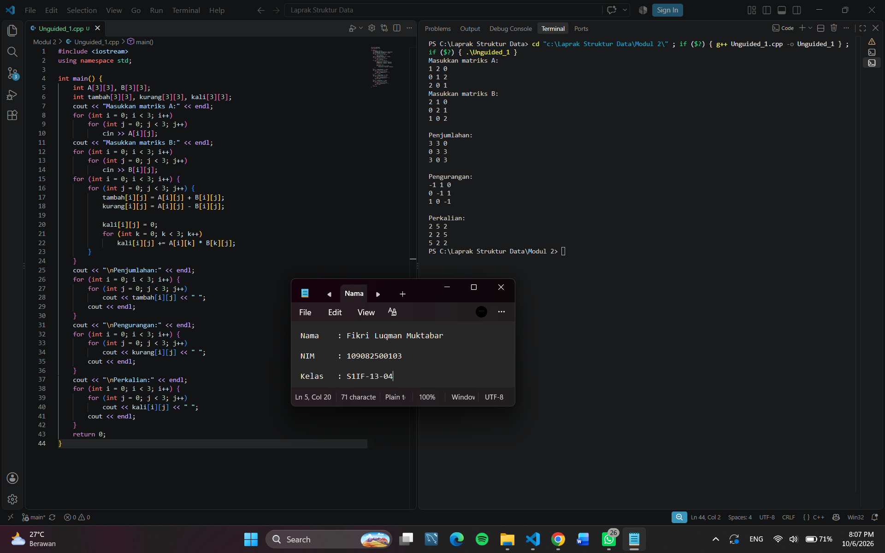
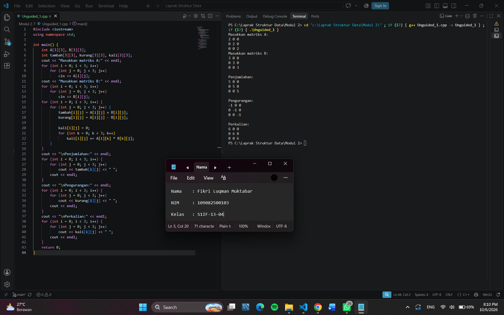
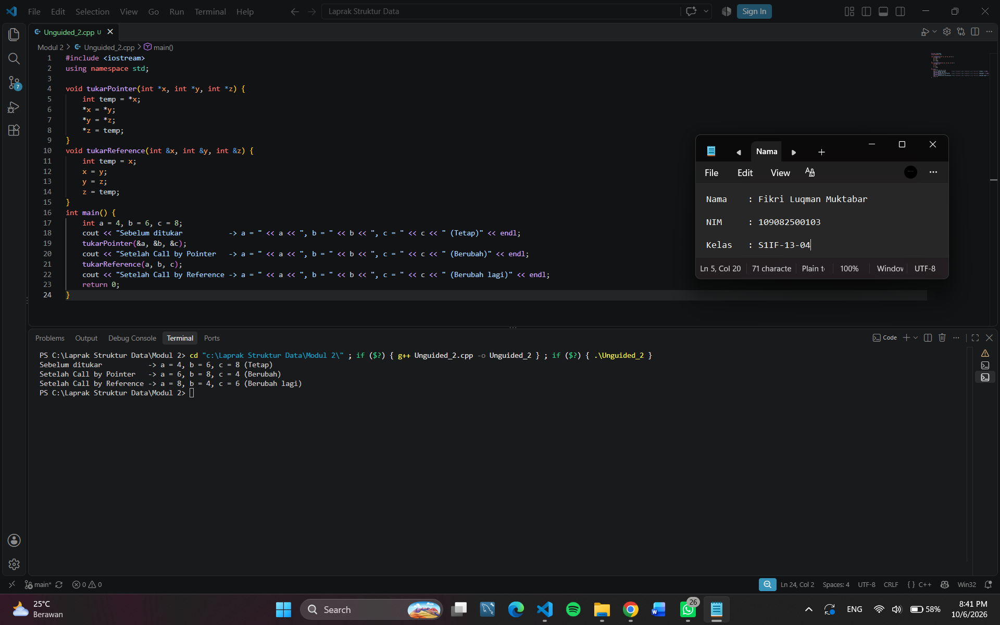
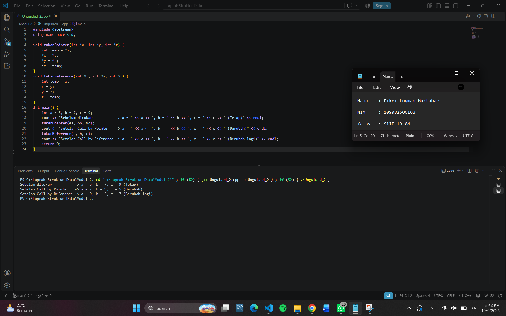
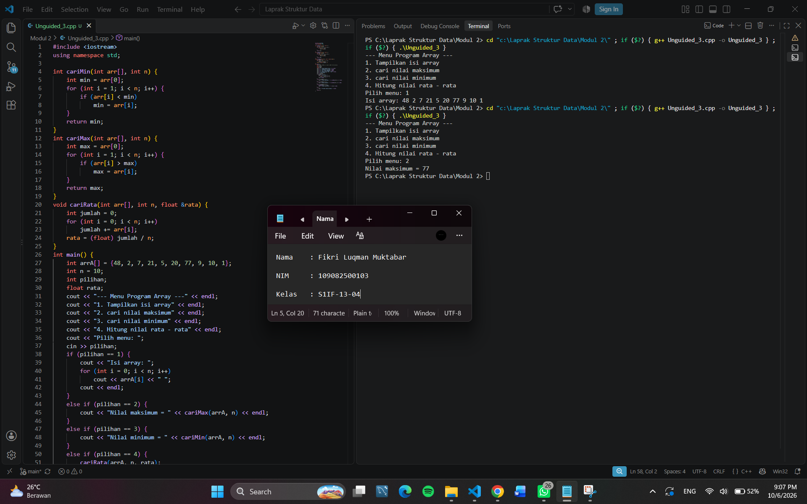
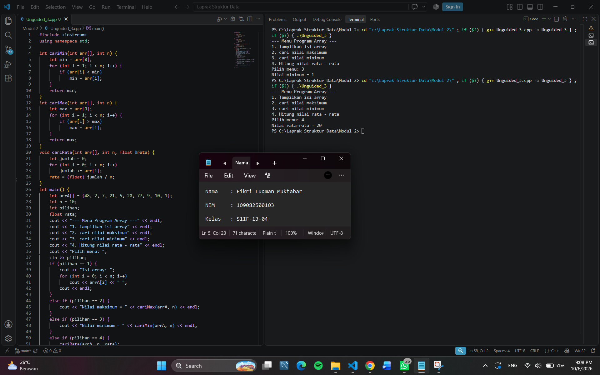

# <h1 align="center">Laporan Praktikum Modul 2 - Pengenalan Bahasa C++ (Bagian Kedua)</h1>

<p align="center">Fikri Luqman Muktabar - 109082500103</p>

## Dasar Teori
Dalam pemrograman C++, program dapat dibuat dengan menggunakan berbagai konsep untuk mengolah data dan menyelesaikan suatu permasalahan. Penggunaan array membantu menyimpan sejumlah data dalam satu variabel, sedangkan pointer digunakan untuk mengakses alamat memori. Selain itu, fungsi dan prosedur digunakan untuk membagi program menjadi bagian-bagian tertentu agar lebih terstruktur. Parameter digunakan untuk memberikan data yang dibutuhkan oleh fungsi atau prosedur. Pemahaman konsep-konsep tersebut diperlukan untuk membuat program yang lebih terstruktur dan mudah dikembangkan.

### A. Dasar Bahasa C++<br/>
C++ merupakan bahasa pemrograman yang dapat digunakan untuk membuat berbagai program. Dalam praktikum ini dibahas beberapa konsep dasar, yaitu array, pointer, fungsi, prosedur, dan parameter fungsi. Konsep-konsep tersebut digunakan untuk mengolah data dan membuat program secara terstruktur.

#### 1. Array
Array merupakan kumpulan data dengan tipe yang sama dan memiliki nama yang sama. Setiap elemen array dapat diakses menggunakan indeks. Array dapat berupa array satu dimensi, dua dimensi, maupun berdimensi banyak. Array satu dimensi menggunakan satu indeks, sedangkan array dua dimensi menggunakan dua indeks untuk menunjukkan posisi baris dan kolom.

#### 2. Pointer
Pointer merupakan variabel yang digunakan untuk menyimpan alamat memori dari variabel lain. Operator & digunakan untuk mendapatkan alamat suatu variabel, sedangkan operator * digunakan untuk mengakses nilai yang ditunjuk oleh pointer. Pointer dapat digunakan untuk mengakses dan mengubah nilai dari variabel yang ditunjuk.

#### 3. Fungsi
Fungsi merupakan blok kode yang dirancang untuk melaksanakan tugas tertentu. Penggunaan fungsi membuat program menjadi lebih terstruktur dan dapat mengurangi pengulangan kode. Fungsi dapat menerima masukan melalui parameter dan menghasilkan nilai balik menggunakan return. Bentuk umum fungsi adalah tipe_keluaran nama_fungsi(daftar_parameter).

#### 4. Prosedur
Prosedur merupakan fungsi yang tidak mengembalikan nilai. Dalam C++, prosedur dikenal sebagai fungsi void yang digunakan untuk melakukan tugas tertentu tanpa memberikan nilai balik kepada pemanggilnya. Bentuk umum prosedur adalah void nama_prosedur(daftar_parameter).

#### 5. Parameter Fungsi
Parameter fungsi digunakan untuk memberikan data yang akan diproses oleh fungsi. Parameter dapat berupa parameter formal yang dituliskan pada definisi fungsi dan parameter aktual yang diberikan saat fungsi dipanggil. Parameter dapat digunakan dengan cara call by value, call by pointer, dan call by reference.

## Guided

### 1.

```C++
#include <iostream>
#define MAX 5
using namespace std;

int main() {
    int i, j;
    float nilai_total, rata_rata;
    float nilai[MAX];
    static int nilai_tahun [MAX] [MAX]=
    {   {0,2,2,0,0},
        {0,1,1,1,0},
        {0,3,3,3,0},
        {4,4,0,0,4},
        {5,0,0,0,5}
    };

    for (i=0; i<MAX; i++){
        cout << "masukkan nilai ke-" << i+1 << endl;
        cin >> nilai[i];
    }
    cout << "\ndata nilai siswa :\n";

    for (i=0; i<MAX; i++)
        cout << "nilai k-" << i+1 << "=" << nilai[i] << endl;
    cout << "\n nilai tahunan : \n";

    for(i=0; i<MAX; i++){
        for(j=0; j<MAX; j++)
            cout << nilai_tahun[i][j];
        cout << "\n";
    }
    return 0;
}
```

### Penjelasan Singkat Guided 1
Program ini digunakan untuk memasukkan dan menampilkan nilai siswa serta menampilkan data nilai tahunan dalam bentuk array 2 dimensi. #include <iostream> digunakan untuk input dan output, sedangkan #define MAX 5 digunakan untuk menentukan ukuran array sebanyak 5. float nilai[MAX] digunakan untuk menyimpan 5 nilai siswa, sedangkan nilai_tahun[MAX][MAX] digunakan untuk menyimpan data dalam bentuk array 2 dimensi berukuran 5×5. Perulangan for pertama digunakan untuk memasukkan nilai siswa melalui cin. Perulangan berikutnya digunakan untuk menampilkan nilai siswa yang telah dimasukkan. Kemudian, perulangan for bersarang digunakan untuk menampilkan seluruh isi array nilai_tahun. cout digunakan untuk menampilkan data.

### 2. 

```C++
#include <iostream>
using namespace std;

int main() {
    int x, y;
    int *px;

    x = 87;
    px = &x;
    y = *px;

    cout << "Alamat x               = " << &x << endl;
    cout << "Isi px                 = " << px << endl;
    cout << "Isi X                  = " << x << endl;
    cout << "Nilai yang ditunjuk px = " << *px << endl;
    cout << "Nilai y                = " << y << endl;
    
    return 0;
}
```

### Penjelasan Singkat Guided 2
Program ini digunakan untuk memahami penggunaan pointer dalam C++. #include <iostream> digunakan untuk input dan output, sedangkan using namespace std; agar dapat menggunakan cout. Pada int main(), variabel x dan y digunakan untuk menyimpan nilai, sedangkan int *px digunakan untuk mendeklarasikan pointer. x = 87; digunakan untuk memberikan nilai 87 pada x. px = &x; digunakan untuk menyimpan alamat memori dari x ke pointer px. y = *px; digunakan untuk mengambil nilai yang ditunjuk oleh px dan menyimpannya ke y. Selanjutnya, cout digunakan untuk menampilkan alamat x, isi pointer px, nilai x, nilai yang ditunjuk oleh px, dan nilai y.

### 3. 

```C++
#include <iostream>
using namespace std;

int maks3(int a, int b, int c);
int main() {
    int x, y, z;
    cout << "masukkan nilai bilangan ke-1 = ";
    cin >> x;
    cout << "masukkan nilai bilangan ke-2 = ";
    cin >> y;
    cout << "masukkan nilai bilangan ke-3 = ";
    cin >> z;
    cout << "nilai maksimumnya adalah = " << maks3(x,y,z);
    return 0;
}

int maks3(int a, int b, int c) {
    int temp_max = a;
    if(b > temp_max)
        temp_max = b;
    if(c > temp_max)
        temp_max = c;
    return (temp_max);
}
```

### Penjelasan Singkat Guided 3
Program ini digunakan untuk mencari nilai maksimum dari tiga bilangan menggunakan fungsi. #include <iostream> digunakan untuk input dan output, sedangkan using namespace std; agar dapat menggunakan cin dan cout. int maks3(int a, int b, int c); digunakan untuk mendeklarasikan fungsi maks3() dengan tiga parameter. Pada int main(), variabel x, y, dan z digunakan untuk menyimpan tiga bilangan yang dimasukkan melalui cin. maks3(x,y,z) digunakan untuk memanggil fungsi dan mencari nilai terbesar dari ketiga bilangan tersebut. Pada fungsi maks3(), temp_max digunakan untuk menyimpan nilai terbesar sementara. Kondisi if(b > temp_max) dan if(c > temp_max) digunakan untuk membandingkan nilai b dan c dengan nilai terbesar sementara. return (temp_max); digunakan untuk mengembalikan nilai maksimum. Terakhir, cout digunakan untuk menampilkan nilai maksimum.

### 4. 

```C++
#include <iostream>
using namespace std;

void tulis(int x);
int main() {
    int jum;
    cout << "jumlah baris kata = ";
    cin >> jum;
    tulis(jum);
    return 0;
}

void tulis(int x) {
    for (int i=0; i<x; i++)
        cout << "baris ke-" << i+1 << endl;
}
```

### Penjelasan Singkat Guided 4
Program ini digunakan untuk menampilkan baris kata sesuai dengan jumlah yang dimasukkan. #include <iostream> digunakan untuk input dan output, sedangkan using namespace std; agar dapat menggunakan cin dan cout. void tulis(int x); digunakan untuk mendeklarasikan prosedur tulis() dengan parameter x. Pada int main(), program mulai dijalankan. int jum; digunakan untuk mendeklarasikan variabel jumlah baris. cin >> jum; digunakan untuk menerima input jumlah baris yang ingin ditampilkan. tulis(jum); digunakan untuk memanggil prosedur tulis() dengan nilai jum sebagai parameter. Pada prosedur tulis(int x), perulangan for digunakan untuk menampilkan tulisan baris ke- sebanyak nilai yang dimasukkan. cout << "baris ke-" << i+1 digunakan untuk menampilkan nomor setiap baris.

### 5. 

```C++
#include <iostream>
using namespace std;

void tukarValue(int x, int y) {
    int temp = x;
    x = y;
    y = temp;
}

void tukarPointer(int *x, int *y) {
    int temp = *x;
    *x = *y;
    *y = temp;
}

void tukarReference(int &x, int &y) {
    int temp = x;
    x = y;
    y = temp;
}   

int main() {
    int a = 4, b = 6;

    tukarValue(a, b);
    cout << "Setelah Call by Value     -> a = " << a << ", b = " << b << " (Tetap)" << endl;

    tukarPointer(&a, &b);
    cout << "Setelah Call by Pointer   -> a = " << a << ", b = " << b << " (Berubah!)" << endl;

    tukarReference(a, b);
    cout << "Setelah Call by Reference -> a = " << a << ", b = " << b << " (Berubah lagi!)" << endl;

    return 0;
}
```

### Penjelasan Singkat Guided 5
Program ini digunakan untuk membandingkan cara pertukaran nilai menggunakan Call by Value, Call by Pointer, dan Call by Reference. #include <iostream> digunakan untuk input dan output, sedangkan using namespace std; agar dapat menggunakan cout. Fungsi tukarValue(int x, int y) digunakan untuk menukar nilai dengan Call by Value, sehingga perubahan hanya terjadi pada salinan nilai dan nilai asli tetap. Fungsi tukarPointer(int *x, int *y) digunakan untuk menukar nilai melalui alamat memori dengan pointer. Fungsi tukarReference(int &x, int &y) digunakan untuk menukar nilai secara langsung melalui reference. Pada int main(), variabel a dan b diberi nilai awal 4 dan 6. tukarValue(a, b) dipanggil sehingga nilai a dan b tetap. Kemudian tukarPointer(&a, &b) menukar nilai menjadi 6 dan 4. Setelah itu, tukarReference(a, b) menukar kembali nilai menjadi 4 dan 6. cout digunakan untuk menampilkan hasil dari setiap metode pertukaran.

## Unguided

### 1. Buatlah program yang dapat melakukan operasi penjumlahan, pengurangan, dan perkalian matriks 3x3.

```C++
#include <iostream>
using namespace std;

int main() {
    int A[3][3], B[3][3];
    int tambah[3][3], kurang[3][3], kali[3][3];
    cout << "Masukkan matriks A:" << endl;
    for (int i = 0; i < 3; i++)
        for (int j = 0; j < 3; j++)
            cin >> A[i][j];
    cout << "Masukkan matriks B:" << endl;
    for (int i = 0; i < 3; i++)
        for (int j = 0; j < 3; j++)
            cin >> B[i][j];
    for (int i = 0; i < 3; i++) {
        for (int j = 0; j < 3; j++) {
            tambah[i][j] = A[i][j] + B[i][j];
            kurang[i][j] = A[i][j] - B[i][j];

            kali[i][j] = 0;
            for (int k = 0; k < 3; k++)
                kali[i][j] += A[i][k] * B[k][j];
        }
    }
    cout << "\nPenjumlahan:" << endl;
    for (int i = 0; i < 3; i++) {
        for (int j = 0; j < 3; j++)
            cout << tambah[i][j] << " ";
        cout << endl;
    }
    cout << "\nPengurangan:" << endl;
    for (int i = 0; i < 3; i++) {
        for (int j = 0; j < 3; j++)
            cout << kurang[i][j] << " ";
        cout << endl;
    }
    cout << "\nPerkalian:" << endl;
    for (int i = 0; i < 3; i++) {
        for (int j = 0; j < 3; j++)
            cout << kali[i][j] << " ";
        cout << endl;
    }
    return 0;
}
```

### Output Unguided 1 :

##### Output 1



##### Output 2



### Penjelasan Unguided 1
Program ini digunakan untuk melakukan operasi penjumlahan, pengurangan, dan perkalian pada dua matriks berukuran 3×3. #include <iostream> digunakan untuk input dan output, sedangkan using namespace std; agar dapat menggunakan cin dan cout. A[3][3] dan B[3][3] digunakan untuk menyimpan dua matriks 3×3, sedangkan tambah, kurang, dan kali digunakan untuk menyimpan hasil operasi matriks. Perulangan for digunakan untuk memasukkan setiap elemen matriks A dan B. tambah[i][j] = A[i][j] + B[i][j] digunakan untuk menghitung penjumlahan, sedangkan kurang[i][j] = A[i][j] - B[i][j] digunakan untuk menghitung pengurangan. Pada perkalian matriks, perulangan for dengan variabel k digunakan untuk menghitung hasil perkalian setiap elemen matriks. Terakhir, cout dan perulangan for digunakan untuk menampilkan hasil penjumlahan, pengurangan, dan perkalian matriks.

### 2. Berdasarkan guided pointer dan reference sebelumnya, buatlah keduanya dapat menukar nilai dari 3 variabel.

```C++
#include <iostream>
using namespace std;

void tukarPointer(int *x, int *y, int *z) {
    int temp = *x;
    *x = *y;
    *y = *z;
    *z = temp;
}
void tukarReference(int &x, int &y, int &z) {
    int temp = x;
    x = y;
    y = z;
    z = temp;
}
int main() {
    int a = 4, b = 6, c = 8;
    cout << "Sebelum ditukar           -> a = " << a << ", b = " << b << ", c = " << c << " (Tetap)" << endl;
    tukarPointer(&a, &b, &c);
    cout << "Setelah Call by Pointer   -> a = " << a << ", b = " << b << ", c = " << c << " (Berubah)" << endl;
    tukarReference(a, b, c);
    cout << "Setelah Call by Reference -> a = " << a << ", b = " << b << ", c = " << c << " (Berubah lagi)" << endl;
    return 0;
}
```

### Output Unguided 2 :

##### Output 1



##### Output 2



### Penjelasan Unguided 2
Program ini digunakan untuk menukar nilai tiga variabel menggunakan Call by Pointer dan Call by Reference. #include <iostream> digunakan untuk input dan output, sedangkan using namespace std; agar dapat menggunakan cout. Fungsi tukarPointer(int *x, int *y, int *z) digunakan untuk menukar nilai melalui pointer dengan alamat dari ketiga variabel. Fungsi tukarReference(int &x, int &y, int &z) digunakan untuk menukar nilai melalui reference. Pada int main(), variabel a, b, dan c diberi nilai awal 4, 6, dan 8. tukarPointer(&a, &b, &c) digunakan untuk menukar nilai menjadi 6, 8, dan 4. Selanjutnya, tukarReference(a, b, c) digunakan untuk menukar kembali nilai menjadi 8, 4, dan 6. cout digunakan untuk menampilkan nilai sebelum ditukar, setelah menggunakan Call by Pointer, dan setelah menggunakan Call by Reference.

### 3. Diketahui sebuah array 1 dimensi sebagai berikut : arrA = {48, 2, 7 , 21, 5, 20, 77, 9, 10, 1} Buatlah program yang dapat mencari nilai minimum, maksimum, dan rata – rata dari array tersebut! Kerjakan soal dengan ketentuan : - Untuk mencari nilai minimum dan maksimum, harus dibuat menjadi sebuah function.- Untuk mencari rata-rata harus dibuat menjadi sebuah procedure. - Buat output di fungsi utama (main) untuk menampilkan nilai rata-rata yang sudah didapatkan melalui procedure sebelumnya. (Gunakan metode pass by reference atau pass by pointer) - Buat menu sederhana untuk menjalankan setiap procedure. Dengan tampilan menu sebagai berikut:
--- Menu Program Array ---
1. Tampilkan isi array
2. cari nilai maksimum
3. cari nilai minimum
4. Hitung nilai rata - rata

```C++
#include <iostream>
using namespace std;

int cariMin(int arr[], int n) {
    int min = arr[0];
    for (int i = 1; i < n; i++) {
        if (arr[i] < min)
            min = arr[i];
    }
    return min;
}
int cariMax(int arr[], int n) {
    int max = arr[0];
    for (int i = 1; i < n; i++) {
        if (arr[i] > max)
            max = arr[i];
    }
    return max;
}
void cariRata(int arr[], int n, float &rata) {
    int jumlah = 0;
    for (int i = 0; i < n; i++)
        jumlah += arr[i];
    rata = (float) jumlah / n;
}
int main() {
    int arrA[] = {48, 2, 7, 21, 5, 20, 77, 9, 10, 1};
    int n = 10;
    int pilihan;
    float rata;
    cout << "--- Menu Program Array ---" << endl;
    cout << "1. Tampilkan isi array" << endl;
    cout << "2. cari nilai maksimum" << endl;
    cout << "3. cari nilai minimum" << endl;
    cout << "4. Hitung nilai rata - rata" << endl;
    cout << "Pilih menu: ";
    cin >> pilihan;
    if (pilihan == 1) {
        cout << "Isi array: ";
        for (int i = 0; i < n; i++)
            cout << arrA[i] << " ";
        cout << endl;
    }
    else if (pilihan == 2) {
        cout << "Nilai maksimum = " << cariMax(arrA, n) << endl;
    }
    else if (pilihan == 3) {
        cout << "Nilai minimum = " << cariMin(arrA, n) << endl;
    }
    else if (pilihan == 4) {
        cariRata(arrA, n, rata);
        cout << "Nilai rata-rata = " << rata << endl;
    }
    else {
        cout << "Pilihan tidak tersedia." << endl;
    }
    return 0;
}
```

### Output Unguided 3 :

##### Output 1



##### Output 2



### Penjelasan Unguided 3
Program ini digunakan untuk mengolah data array dengan mencari nilai maksimum, minimum, dan rata-rata. #include <iostream> digunakan untuk input dan output, sedangkan using namespace std; agar dapat menggunakan cin dan cout. Fungsi cariMin() digunakan untuk mencari nilai terkecil dalam array, sedangkan fungsi cariMax() digunakan untuk mencari nilai terbesar. Prosedur cariRata() digunakan untuk menghitung nilai rata-rata dengan parameter reference float &rata. Pada int main(), arrA digunakan untuk menyimpan 10 nilai array dan n = 10 menunjukkan jumlah data. Program menampilkan menu dengan empat pilihan, yaitu menampilkan isi array, mencari nilai maksimum, mencari nilai minimum, dan menghitung nilai rata-rata. cin >> pilihan digunakan untuk menerima pilihan menu. Kondisi if dan else if digunakan untuk menjalankan proses sesuai pilihan pengguna. Terakhir, cout digunakan untuk menampilkan hasil dari pilihan yang dipilih.

## Kesimpulan
Saya masih berusaha memahami konsep dasar pemrograman C++, seperti variabel, tipe data, operator, input/output, percabangan, perulangan, struct, dan fungsi. Saya juga sedang belajar menerapkan konsep tersebut melalui program guided dan unguided. Selain itu, saya masih dalam tahap menyesuaikan diri dengan bahasa C++ karena sebelumnya lebih sering menggunakan bahasa pemrograman Go (Golang), sehingga masih perlu berlatih dalam penggunaan syntax dan struktur program C++.

## Referensi

[1] Azzam, H. N., & Ubaidillah, A. S. (2025). Studi Perancangan dan Implementasi Sistem Kasir Sederhana Menggunakan Bahasa Pemrograman C++ pada Platform Code::Blocks. Jurnal Aplikasi Teknologi dan Komputasi.
<br>[2] Anggoro, H. B. (2013). Media Tutorial Pemrograman Bahasa C Berbasis Camtasia. Edu Elektrika Journal.
<br>